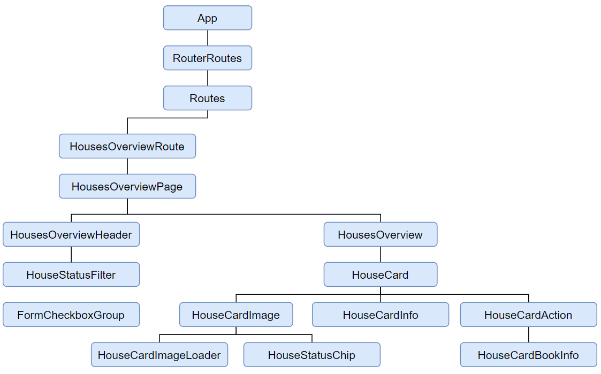

# Lodgify - Frontend Technical Test

Lodigfy test is a react app that lists the houses of a customer

## Requirements

  - [npm](https://www.npmjs.com/) as package manager


## Start

First, install all dependencies by running the following command on your project directory:

```bash
npm install
```

You can run the app in the development mode:

```bash
npm start
```

## Architecture

In this section, I'm going to explain how the app was structured. The first thing I want to point is how to split a component. Usually, a component can be split in a container and a component, container states for the component's logic and the component states for the presentation/visual of the component.

### Modules

The main modules that you can found in the app are:
* [./core](https://github.com/bilaluali/lodgify-test-app/tree/master/src/modules/core): as the name describes, includes the core components of the application such as the redux config, the router...
* [./material-ui](https://github.com/bilaluali/lodgify-test-app/tree/master/src/modules/material-ui): improved and adapted components from the material-ui library which can be used among the entire app.
* [./models](https://github.com/bilaluali/lodgify-test-app/tree/master/src/modules/models): includes the redux files for each application entity.
* [./house](https://github.com/bilaluali/lodgify-test-app/tree/master/src/modules/house): usually we will define a module per entity where we will define the containers and components related to the entity.
* [./ui](https://github.com/bilaluali/lodgify-test-app/tree/master/src/modules/ui): "core" components that will be used among the entire application. This module should include few components such as Page, AppBar... Everything else should be placed in ```material-ui``` module.

### Route example

If you're not familiar with this architecture, it may be confusing to know where to start checking the files for a concrete route. Hence, in the image below, you can see a tree showing the composition. Please note in the diagram I avoided putting in the tree both, the component and the container. So that, if the component has a container, first check the container.



## Storybook

You can start Storybook:

```bash
npm run storybook
```
There's a bug between the newest version of material-ui (v5) and storybook when defining a material-ui custom theme. Hence, if you run storybook, some stories will crash. Check the [issue](https://github.com/mui-org/material-ui/issues/24282) here.